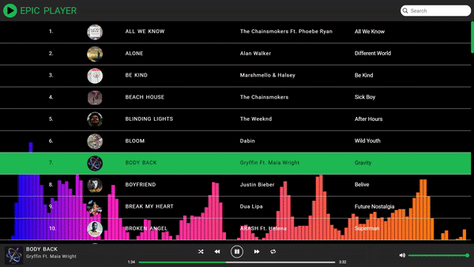

# 𝓔𝓹𝓲𝓬-𝓟𝓵𝓪𝔂𝓮𝓻

Epic Player is a music player with Epic Playlist.

## How to run

1. To run the Epic Player in your local machine you need to download all the songs in the Epic Player.
You can find the song source in the `songList.json`. And then you have to comment/remove and uncomment 242 and 243 line respectively in `code.ts`.

1. You also have to download the [thumbnail](https://bit.ly/37EY20M) of the songs.

### Support Me

